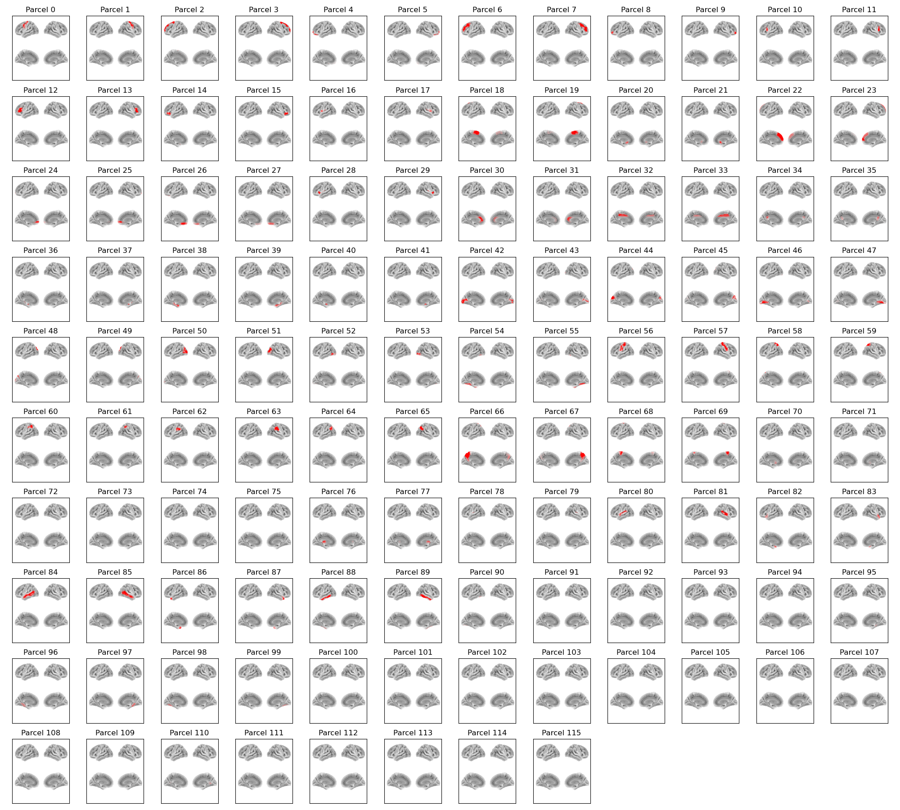

# AAL116 Parcellation

This parcellation file is named `atlas-AAL_nparc-116_space-MNI_res-8x8x8.nii.gz`.

This parcellation contains the **116 regions** (cortical, subcortical, and cerebellar) from the [Automated Anatomical Labelling](https://www.gin.cnrs.fr/en/tools/aal/) atlas (AAL SPM12).

## Parcels



Labels and MNI coordinates:

| Index | Parcel | Hemisphere | X | Y | Z |
| --- | --- | --- | --- | --- | --- |
| 0 | Precentral | left | -38.9 | -6.8 | 48.3 |
| 1 | Precentral | right | 40.5 | -9.9 | 50.2 |
| 2 | Frontal_Sup | left | -18.7 | 33.2 | 40.0 |
| 3 | Frontal_Sup | right | 21.4 | 29.1 | 41.9 |
| 4 | Frontal_Sup_Orb | left | -16.9 | 46.1 | -14.5 |
| 5 | Frontal_Sup_Orb | right | 18.0 | 46.2 | -14.8 |
| 6 | Frontal_Mid | left | -32.9 | 30.7 | 33.8 |
| 7 | Frontal_Mid | right | 36.4 | 31.0 | 32.9 |
| 8 | Frontal_Mid_Orb | left | -30.6 | 48.6 | -10.5 |
| 9 | Frontal_Mid_Orb | right | 32.8 | 51.1 | -11.2 |
| 10 | Frontal_Inf_Oper | left | -48.1 | 11.1 | 17.5 |
| 11 | Frontal_Inf_Oper | right | 48.1 | 13.1 | 19.8 |
| 12 | Frontal_Inf_Tri | left | -44.7 | 28.3 | 12.6 |
| 13 | Frontal_Inf_Tri | right | 48.2 | 28.1 | 13.0 |
| 14 | Frontal_Inf_Orb | left | -35.5 | 29.3 | -13.3 |
| 15 | Frontal_Inf_Orb | right | 39.3 | 30.8 | -12.9 |
| 16 | Rolandic_Oper | left | -47.3 | -9.9 | 12.7 |
| 17 | Rolandic_Oper | right | 51.1 | -8.8 | 13.8 |
| 18 | Supp_Motor_Area | left | -5.6 | 3.3 | 58.9 |
| 19 | Supp_Motor_Area | right | 8.2 | -1.4 | 59.8 |
| 20 | Olfactory | left | -7.9 | 14.3 | -12.2 |
| 21 | Olfactory | right | 9.6 | 15.0 | -12.2 |
| 22 | Frontal_Sup_Medial | left | -5.1 | 47.2 | 29.4 |
| 23 | Frontal_Sup_Medial | right | 8.5 | 49.1 | 28.4 |
| 24 | Frontal_Med_Orb | left | -5.4 | 52.0 | -9.1 |
| 25 | Frontal_Med_Orb | right | 7.8 | 50.0 | -8.4 |
| 26 | Rectus | left | -5.4 | 35.3 | -19.4 |
| 27 | Rectus | right | 7.9 | 34.4 | -19.2 |
| 28 | Insula | left | -35.4 | 5.5 | 2.2 |
| 29 | Insula | right | 38.7 | 5.1 | 0.8 |
| 30 | Cingulum_Ant | left | -4.2 | 34.2 | 12.7 |
| 31 | Cingulum_Ant | right | 8.1 | 35.6 | 14.7 |
| 32 | Cingulum_Mid | left | -5.8 | -16.0 | 40.0 |
| 33 | Cingulum_Mid | right | 7.6 | -10.2 | 38.6 |
| 34 | Cingulum_Post | left | -5.1 | -44.3 | 23.5 |
| 35 | Cingulum_Post | right | 6.9 | -42.9 | 20.4 |
| 36 | Hippocampus | left | -25.4 | -21.8 | -11.6 |
| 37 | Hippocampus | right | 28.9 | -21.0 | -11.5 |
| 38 | ParaHippocampal | left | -21.6 | -17.4 | -21.7 |
| 39 | ParaHippocampal | right | 25.1 | -16.3 | -21.7 |
| 40 | Amygdala | left | -23.6 | -1.8 | -18.4 |
| 41 | Amygdala | right | 27.2 | -0.6 | -18.8 |
| 42 | Calcarine | left | -8.1 | -78.6 | 5.4 |
| 43 | Calcarine | right | 15.8 | -74.2 | 8.0 |
| 44 | Cuneus | left | -6.9 | -80.1 | 25.8 |
| 45 | Cuneus | right | 13.0 | -80.0 | 26.3 |
| 46 | Lingual | left | -14.9 | -68.8 | -5.9 |
| 47 | Lingual | right | 15.9 | -67.7 | -5.0 |
| 48 | Occipital_Sup | left | -16.6 | -84.9 | 26.3 |
| 49 | Occipital_Sup | right | 23.8 | -80.9 | 29.3 |
| 50 | Occipital_Mid | left | -32.3 | -81.5 | 15.1 |
| 51 | Occipital_Mid | right | 36.8 | -80.0 | 18.2 |
| 52 | Occipital_Inf | left | -36.3 | -79.6 | -9.0 |
| 53 | Occipital_Inf | right | 37.8 | -81.7 | -8.9 |
| 54 | Fusiform | left | -31.6 | -41.9 | -21.1 |
| 55 | Fusiform | right | 33.6 | -41.1 | -20.9 |
| 56 | Postcentral | left | -43.2 | -23.5 | 46.0 |
| 57 | Postcentral | right | 40.8 | -26.6 | 50.0 |
| 58 | Parietal_Sup | left | -23.5 | -60.9 | 56.3 |
| 59 | Parietal_Sup | right | 25.3 | -59.9 | 59.2 |
| 60 | Parietal_Inf | left | -42.9 | -46.6 | 45.2 |
| 61 | Parietal_Inf | right | 45.5 | -47.3 | 48.2 |
| 62 | SupraMarginal | left | -55.8 | -35.0 | 28.9 |
| 63 | SupraMarginal | right | 56.7 | -32.8 | 32.8 |
| 64 | Angular | left | -44.2 | -61.9 | 34.2 |
| 65 | Angular | right | 44.5 | -60.6 | 37.0 |
| 66 | Precuneus | left | -7.6 | -57.5 | 45.3 |
| 67 | Precuneus | right | 9.8 | -57.1 | 40.9 |
| 68 | Paracentral_Lobule | left | -7.9 | -26.9 | 65.2 |
| 69 | Paracentral_Lobule | right | 7.3 | -33.8 | 64.1 |
| 70 | Caudate | left | -12.3 | 9.7 | 7.8 |
| 71 | Caudate | right | 14.5 | 11.0 | 8.2 |
| 72 | Putamen | left | -24.3 | 2.6 | 1.3 |
| 73 | Putamen | right | 27.6 | 3.6 | 1.3 |
| 74 | Pallidum | left | -18.0 | -1.3 | -1.2 |
| 75 | Pallidum | right | 20.9 | -1.0 | -1.1 |
| 76 | Thalamus | left | -11.3 | -18.8 | 6.8 |
| 77 | Thalamus | right | 12.8 | -18.7 | 6.9 |
| 78 | Heschl | left | -42.1 | -20.1 | 8.6 |
| 79 | Heschl | right | 45.3 | -18.5 | 9.4 |
| 80 | Temporal_Sup | left | -52.9 | -22.0 | 5.7 |
| 81 | Temporal_Sup | right | 56.4 | -23.4 | 5.6 |
| 82 | Temporal_Pole_Sup | left | -39.4 | 12.3 | -21.0 |
| 83 | Temporal_Pole_Sup | right | 44.2 | 12.7 | -20.1 |
| 84 | Temporal_Mid | left | -54.5 | -35.8 | -3.2 |
| 85 | Temporal_Mid | right | 55.8 | -38.9 | -2.4 |
| 86 | Temporal_Pole_Mid | left | -35.7 | 12.3 | -35.2 |
| 87 | Temporal_Pole_Mid | right | 41.1 | 12.1 | -33.4 |
| 88 | Temporal_Inf | left | -49.1 | -28.8 | -24.4 |
| 89 | Temporal_Inf | right | 52.2 | -32.7 | -22.7 |
| 90 | Cerebelum_Crus1 | left | -34.0 | -68.2 | -30.1 |
| 91 | Cerebelum_Crus1 | right | 35.3 | -69.1 | -30.6 |
| 92 | Cerebelum_Crus2 | left | -26.4 | -74.6 | -39.3 |
| 93 | Cerebelum_Crus2 | right | 29.7 | -72.3 | -40.3 |
| 94 | Cerebelum_3 | left | -8.5 | -38.3 | -19.9 |
| 95 | Cerebelum_3 | right | 13.3 | -35.6 | -20.7 |
| 96 | Cerebelum_4_5 | left | -14.7 | -44.7 | -18.9 |
| 97 | Cerebelum_4_5 | right | 17.6 | -44.7 | -19.0 |
| 98 | Cerebelum_6 | left | -22.6 | -60.6 | -23.4 |
| 99 | Cerebelum_6 | right | 25.0 | -60.8 | -24.5 |
| 100 | Cerebelum_7b | left | -29.4 | -63.2 | -46.3 |
| 101 | Cerebelum_7b | right | 30.6 | -66.1 | -47.9 |
| 102 | Cerebelum_8 | left | -24.6 | -56.6 | -48.7 |
| 103 | Cerebelum_8 | right | 25.3 | -58.1 | -49.5 |
| 104 | Cerebelum_9 | left | -10.2 | -50.5 | -47.0 |
| 105 | Cerebelum_9 | right | 10.1 | -50.9 | -47.6 |
| 106 | Cerebelum_10 | left | -20.5 | -38.0 | -42.8 |
| 107 | Cerebelum_10 | right | 25.1 | -38.2 | -43.1 |
| 108 | Vermis_1_2 | midline | 1.4 | -40.3 | -21.8 |
| 109 | Vermis_3 | midline | 2.1 | -41.6 | -13.5 |
| 110 | Vermis_4_5 | midline | 1.9 | -54.5 | -8.4 |
| 111 | Vermis_6 | midline | 1.8 | -68.4 | -16.5 |
| 112 | Vermis_7 | midline | 1.8 | -73.0 | -26.2 |
| 113 | Vermis_8 | midline | 1.8 | -65.5 | -35.3 |
| 114 | Vermis_9 | midline | 1.7 | -56.5 | -36.5 |
| 115 | Vermis_10 | midline | 0.5 | -48.1 | -33.2 |

## Example code

Plotting with this parcellation, using osl-dynamics:

```python
from osl_dynamics.analysis import power

power.save(
    ...,
    mask_file="MNI152_T1_8mm_brain.nii.gz",
    parcellation_file="atlas-AAL_nparc-116_space-MNI_res-8x8x8.nii.gz",
    filename="map_.png",
)
```
## Reference

If you use this parcellation, please cite:

    Tzourio-Mazoyer, N., Landeau, B., Papathanassiou, D., Crivello, F., Etard, O., Delcroix, N., Mazoyer, B., & Joliot, M. (2002). Automated Anatomical Labeling of Activations in SPM Using a Macroscopic Anatomical Parcellation of the MNI MRI Single-Subject Brain. *NeuroImage*, 15(1), 273-289. https://doi.org/10.1006/nimg.2001.0978
