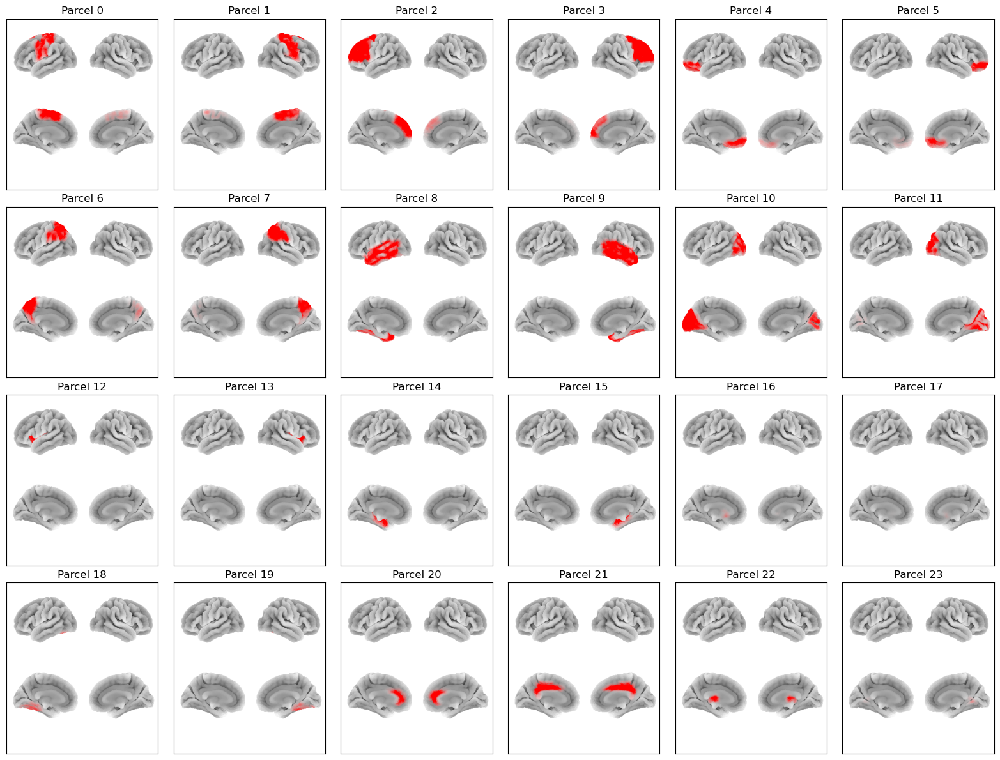

# AAL24 Parcellation

This parcellation file is named `atlas-AAL_nparc-24_space-MNI_res-8x8x8.nii.gz`.

This is a reduced version of the [AAL116 parcellation](aal116.md), obtained by merging the original [Automated Anatomical Labelling](https://www.gin.cnrs.fr/en/tools/aal/) regions into 24 broad anatomical groups (10 bilateral pairs plus 4 midline regions).

## Parcels



Labels and MNI coordinates:

| Index | Parcel | Hemisphere | X | Y | Z |
| --- | --- | --- | --- | --- | --- |
| 0 | Sensorimotor | left | -31.8 | -12.6 | 48.0 |
| 1 | Sensorimotor | right | 32.7 | -14.9 | 48.8 |
| 2 | Lateral Frontal | left | -26.8 | 32.9 | 29.6 |
| 3 | Lateral Frontal | right | 30.8 | 31.1 | 30.8 |
| 4 | Orbitofrontal | left | -20.7 | 38.7 | -13.4 |
| 5 | Orbitofrontal | right | 23.0 | 39.9 | -13.1 |
| 6 | Parietal | left | -29.0 | -53.3 | 44.1 |
| 7 | Parietal | right | 32.3 | -52.1 | 43.0 |
| 8 | Lateral Temporal | left | -47.2 | -26.8 | -11.8 |
| 9 | Lateral Temporal | right | 49.5 | -27.8 | -11.2 |
| 10 | Occipital | left | -19.5 | -78.6 | 9.9 |
| 11 | Occipital | right | 22.7 | -76.3 | 11.0 |
| 12 | Insula | left | -35.4 | 5.5 | 2.2 |
| 13 | Insula | right | 38.7 | 5.1 | 0.8 |
| 14 | Medial Temporal | left | -23.5 | -17.7 | -16.9 |
| 15 | Medial Temporal | right | 26.9 | -16.5 | -17.2 |
| 16 | Basal Ganglia | left | -18.5 | 5.0 | 3.6 |
| 17 | Basal Ganglia | right | 21.2 | 6.2 | 3.9 |
| 18 | Cerebellum (lateral) | left | -24.4 | -60.9 | -34.8 |
| 19 | Cerebellum (lateral) | right | 26.2 | -61.1 | -36.0 |
| 20 | Anterior Cingulate | midline | 1.8 | 34.9 | 13.7 |
| 21 | Middle Cingulate | midline | 1.0 | -18.0 | 36.5 |
| 22 | Thalamus | midline | 0.5 | -18.8 | 6.9 |
| 23 | Cerebellar Vermis | midline | 1.8 | -58.6 | -19.5 |

Each AAL24 parcel was formed by merging the following AAL116 regions:

| Parcel | AAL116 regions |
| --- | --- |
| Sensorimotor | Precentral, Postcentral, Supp_Motor_Area, Paracentral_Lobule, Rolandic_Oper |
| Lateral Frontal | Frontal_Sup, Frontal_Mid, Frontal_Inf_Oper, Frontal_Inf_Tri, Frontal_Sup_Medial |
| Orbitofrontal | Frontal_Sup_Orb, Frontal_Mid_Orb, Frontal_Inf_Orb, Frontal_Med_Orb, Rectus, Olfactory |
| Parietal | Parietal_Sup, Parietal_Inf, Precuneus, SupraMarginal, Angular |
| Lateral Temporal | Temporal_Sup, Temporal_Mid, Temporal_Inf, Temporal_Pole_Sup, Temporal_Pole_Mid, |
|  | Fusiform, Heschl |
| Occipital | Occipital_Sup, Occipital_Mid, Occipital_Inf, Calcarine, Cuneus, Lingual |
| Insula | Insula |
| Medial Temporal | Hippocampus, ParaHippocampal, Amygdala |
| Basal Ganglia | Caudate, Putamen, Pallidum |
| Cerebellum (lateral) | Cerebelum_Crus1, Cerebelum_Crus2, Cerebelum_3, Cerebelum_4_5, Cerebelum_6, Cerebelum_7b, |
|  | Cerebelum_8, Cerebelum_9 |
| Anterior Cingulate | Cingulum_Ant |
| Middle Cingulate | Cingulum_Mid, Cingulum_Post |
| Thalamus | Thalamus |
| Cerebellar Vermis | Vermis_3, Vermis_4_5, Vermis_6, Vermis_7, Vermis_8, Vermis_9, Vermis_10 |

## Example code

Plotting with this parcellation, using osl-dynamics:

```python
from osl_dynamics.analysis import power

power.save(
    ...,
    mask_file="MNI152_T1_8mm_brain.nii.gz",
    parcellation_file="atlas-AAL_nparc-24_space-MNI_res-8x8x8.nii.gz",
    filename="map_.png",
)
```
## Reference

If you use this parcellation, please cite:

    Tzourio-Mazoyer, N., Landeau, B., Papathanassiou, D., Crivello, F., Etard, O., Delcroix, N., Mazoyer, B., & Joliot, M. (2002). Automated Anatomical Labeling of Activations in SPM Using a Macroscopic Anatomical Parcellation of the MNI MRI Single-Subject Brain. *NeuroImage*, 15(1), 273-289. https://doi.org/10.1006/nimg.2001.0978
