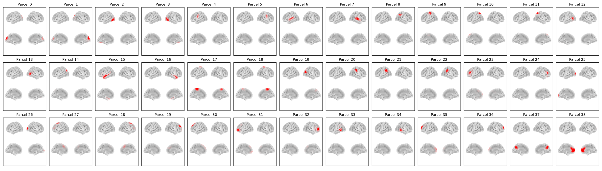

# Giles39 Parcellation

This parcellation file is named `atlas-Giles_nparc-39_space-MNI_res-8x8x8.nii.gz`. It was previously named `fmri_d100_parcellation_with_PCC_tighterMay15_v2_8mm.nii.gz` (osl-dynamics accepts both).

This is a modified version of the [original Giles parcellation](giles38.md) to include the PCC.

This parcellation was used in [Quinn et al. (2018)](https://www.frontiersin.org/journals/neuroscience/articles/10.3389/fnins.2018.00603/full).

## Parcels



Labels and MNI coordinates:

| Index | Parcel | Hemisphere | X | Y | Z |
| --- | --- | --- | --- | --- | --- |
| 0 | Primary / Early Visual Cortex (dorsal) | left | -11.8 | -84.1 | 18.7 |
| 1 | Primary / Early Visual Cortex (dorsal) | right | 16.0 | -81.0 | 19.9 |
| 2 | Ventral Visual / Fusiform | left | -34.8 | -72.1 | 0.5 |
| 3 | Ventral Visual / Fusiform / Lateral Occipital | right | 34.1 | -65.1 | 0.7 |
| 4 | Inferior Frontal / Ventrolateral PFC | left | -50.8 | -11.1 | 31.3 |
| 5 | Inferior Frontal / Ventrolateral PFC | right | 51.2 | -9.4 | 31.1 |
| 6 | Lateral / Inferior Temporal Cortex | left | -52.9 | -21.6 | 5.6 |
| 7 | Lateral / Inferior Temporal Cortex | right | 55.5 | -17.5 | 4.6 |
| 8 | Posterior Superior Temporal / TPJ-ish (right-dominant) | right | 47.8 | -50.6 | 44.8 |
| 9 | Superior Parietal / Dorsal Parietal | left | -33.8 | -25.7 | 57.1 |
| 10 | Precuneus / Superior Medial Parietal | left | -25.6 | -60.0 | 49.6 |
| 11 | Precuneus / Superior Medial Parietal | right | 26.5 | -58.6 | 51.5 |
| 12 | Lateral Occipital / Posterior Temporal | left | -46.7 | -62.5 | 3.7 |
| 13 | Lateral Occipital / Posterior Temporal | right | 45.7 | -58.0 | 3.3 |
| 14 | Intraparietal / Temporal-Parieto-Occipital junction (TPOJ) | left | -32.4 | -73.3 | 40.2 |
| 15 | Anterior Ventral Temporal / Temporal Pole | left | -45.3 | -7.9 | -12.9 |
| 16 | Anterior Ventral Temporal / Temporal Pole | right | 41.9 | -2.0 | -19.7 |
| 17 | Supplementary Motor Area / Medial Motor | left | -13.2 | -26.8 | 62.5 |
| 18 | Supplementary Motor Area / Medial Motor | right | 15.0 | -25.8 | 63.2 |
| 19 | Posterior Intraparietal / dorsal parietal | right | 32.1 | -68.7 | 31.5 |
| 20 | Inferior Parietal / Angular / Supramarginal (right) | right | 57.4 | -31.5 | 38.8 |
| 21 | Inferior Parietal / Angular / Supramarginal (left) | left | -55.3 | -47.5 | 27.6 |
| 22 | Inferior Parietal / Angular / Supramarginal (right) | right | 56.7 | -41.3 | 29.5 |
| 23 | Ventrolateral PFC / Inferior Frontal | left | -30.7 | 26.5 | 13.6 |
| 24 | Ventrolateral PFC / Inferior Frontal | right | 42.2 | 27.7 | 8.0 |
| 25 | Occipital pole / Primary Visual Cortex (ventral) | left | -20.4 | -92.3 | 5.8 |
| 26 | Occipital pole / Primary Visual Cortex (ventral) | right | 22.9 | -88.7 | 8.4 |
| 27 | Lateral Temporal / Middle Temporal (anterior) | left | -22.8 | 18.9 | 43.5 |
| 28 | Lateral Temporal / Middle Temporal (anterior) | right | 25.4 | 20.7 | 38.7 |
| 29 | Dorsolateral PFC / Superior Frontal | right | 22.1 | 41.4 | 28.5 |
| 30 | Dorsolateral PFC / Superior Frontal | left | -15.2 | 36.7 | 42.7 |
| 31 | Medial / Orbital frontal cluster | left | -27.5 | 43.4 | 4.9 |
| 32 | Lateral frontal cluster | right | 30.5 | 29.1 | 5.8 |
| 33 | Inferior Parietal / posterior temporal (left) | left | -52.7 | -49.6 | 10.7 |
| 34 | Inferior Parietal / posterior temporal (right) | right | 60.1 | -39.7 | -2.7 |
| 35 | Dorsomedial / medial prefrontal | left | -18.9 | 47.5 | 22.0 |
| 36 | Dorsomedial / medial prefrontal | right | 21.8 | 51.6 | 21.6 |
| 37 | Posterior Cingulate / Midline Precuneus | midline | 0.4 | -60.1 | 33.9 |
| 38 | Anterior Cingulate / Medial Prefrontal (midline) | midline | 0.1 | 44.1 | 10.4 |

## Example code

Plotting with this parcellation, using osl-dynamics:

```python
from osl_dynamics.analysis import power

power.save(
    ...,
    mask_file="MNI152_T1_8mm_brain.nii.gz",
    parcellation_file="atlas-Giles_nparc-39_space-MNI_res-8x8x8.nii.gz",
    filename="map_.png",
)
```
