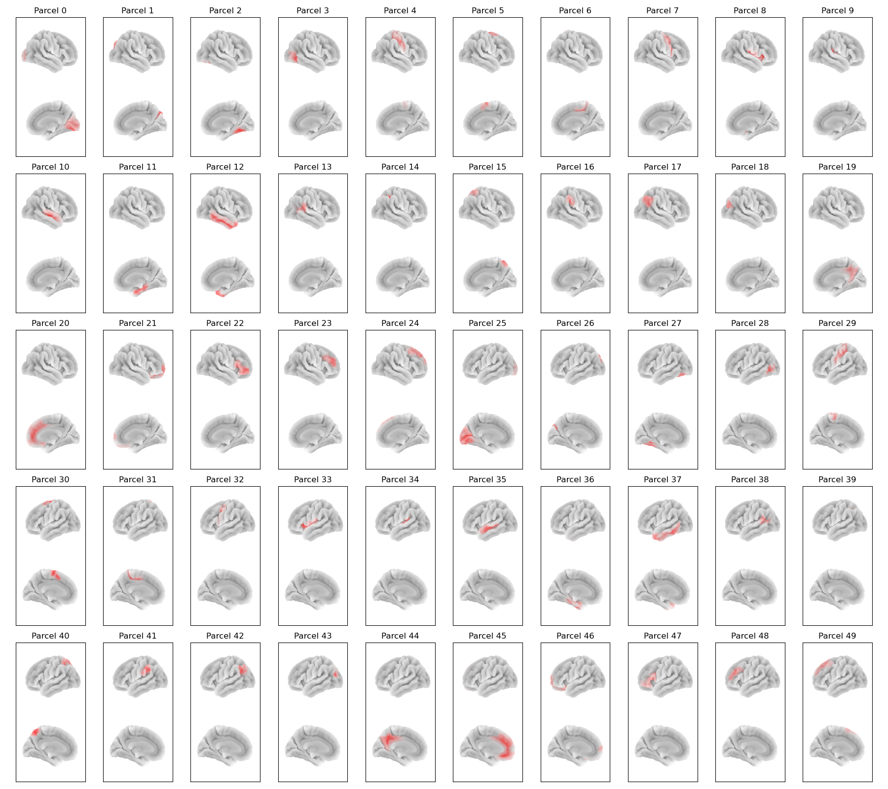

# Glasser50 Parcellation

In osl-dynamics, this parcellation file is named `atlas-Glasser_nparc-50_space-MNI_res-8x8x8.nii.gz`, however, this parcellation file was previously named `Glasser50_binary_space-MNI152NLin6_res-8x8x8.nii.gz` (both names will work).

This is a reduced version of the [Glasser52 parcellation](glasser52.md).

## Parcels



Labels and MNI coordinates:

| Index | Parcel | Hemisphere | X | Y | Z |
| --- | --- | --- | --- | --- | --- |
| 0 | Primary and Early Visual Cortex | right | 13.9 | -80.1 | 1.0 |
| 1 | Dorsal Stream Visual Cortex | right | 19.1 | -80.8 | 31.9 |
| 2 | Ventral Stream Visual Cortex | right | 29.2 | -57.3 | -16.4 |
| 3 | MT+ Complex and Neighboring Visual Areas | right | 43.6 | -71.8 | -0.7 |
| 4 | Somatosensory and Motor Cortex | right | 37.7 | -21.8 | 50.1 |
| 5 | Supplementary Motor Area | right | 12.9 | -1.1 | 63.8 |
| 6 | Cingulate Motor Areas & Area 5 | right | 7.9 | -29.9 | 52.3 |
| 7 | Premotor Cortex | right | 42.5 | 1.2 | 40.4 |
| 8 | Insular & Frontoparietal Operculum | right | 40.6 | 1.2 | 2.9 |
| 9 | Early Auditory Cortex | right | 46.3 | -23.3 | 12.2 |
| 10 | Auditory Association Cortex | right | 55.6 | -12.4 | -7.1 |
| 11 | Medial Temporal Cortex | right | 27.5 | -21.7 | -23.9 |
| 12 | Lateral Temporal Cortex | right | 48.2 | -15.4 | -25.9 |
| 13 | Temporal-Parieto-Occipital Junction | right | 54.9 | -46.9 | 12.6 |
| 14 | Medial Bank of the Intra-parietal Sulcus | right | 29.6 | -51.6 | 44.6 |
| 15 | Superior Medial Parietal Cortex | right | 18.5 | -57.9 | 59.1 |
| 16 | Inferior Parietal Cortex Task-Positive Network | right | 57.2 | -29.3 | 35.0 |
| 17 | Inferior Parietal Cortex Task-Negative Network | right | 47.7 | -57.7 | 35.0 |
| 18 | Intraparietal Sulcus & PGP | right | 36.0 | -71.7 | 31.9 |
| 19 | Posterior Cingulate Cortex | right | 8.9 | -55.8 | 27.7 |
| 20 | Anterior Cingulate and Medial Prefrontal Cortex | right | 5.2 | 34.2 | 15.3 |
| 21 | Orbital and Polar Frontal Cortex | right | 18.5 | 45.8 | -11.8 |
| 22 | Inferior Frontal Cortex | right | 45.1 | 32.9 | 2.8 |
| 23 | Inferior Dorso-Lateral Prefrontal Cortex | right | 36.7 | 37.3 | 25.6 |
| 24 | Superior Dorso-Lateral Prefrontal Cortex | right | 20.8 | 32.9 | 45.4 |
| 25 | Primary and Early Visual Cortex | left | -13.9 | -81.5 | 1.3 |
| 26 | Dorsal Stream Visual Cortex | left | -21.4 | -82.5 | 29.5 |
| 27 | Ventral Stream Visual Cortex | left | -34.0 | -57.4 | -17.4 |
| 28 | MT+ Complex and Neighboring Visual Areas | left | -47.0 | -69.7 | -2.5 |
| 29 | Somatosensory and Motor Cortex | left | -36.2 | -24.7 | 52.0 |
| 30 | Supplementary Motor Area | left | -12.6 | -1.7 | 62.7 |
| 31 | Cingulate Motor Areas & Area 5 | left | -10.5 | -28.4 | 51.6 |
| 32 | Premotor Cortex | left | -42.7 | -0.7 | 42.5 |
| 33 | Insular & Frontoparietal Operculum | left | -43.2 | 0.0 | 2.9 |
| 34 | Early Auditory Cortex | left | -49.1 | -25.9 | 10.6 |
| 35 | Auditory Association Cortex | left | -57.0 | -14.8 | -7.4 |
| 36 | Medial Temporal Cortex | left | -30.6 | -22.6 | -24.2 |
| 37 | Lateral Temporal Cortex | left | -50.4 | -17.8 | -24.9 |
| 38 | Temporal-Parieto-Occipital Junction | left | -55.9 | -52.2 | 13.8 |
| 39 | Medial Bank of the Intra-parietal Sulcus | left | -32.7 | -52.2 | 43.0 |
| 40 | Superior Medial Parietal Cortex | left | -19.0 | -59.7 | 57.2 |
| 41 | Inferior Parietal Cortex Task-Positive Network | left | -57.8 | -35.2 | 34.3 |
| 42 | Inferior Parietal Cortex Task-Negative Network | left | -47.1 | -63.1 | 33.5 |
| 43 | Intraparietal Sulcus & PGP | left | -37.0 | -71.4 | 31.7 |
| 44 | Posterior Cingulate Cortex | left | -8.6 | -52.2 | 29.7 |
| 45 | Anterior Cingulate and Medial Prefrontal Cortex | left | -6.1 | 34.8 | 12.2 |
| 46 | Orbital and Polar Frontal Cortex | left | -21.2 | 44.0 | -10.2 |
| 47 | Inferior Frontal Cortex | left | -46.4 | 28.4 | 5.6 |
| 48 | Inferior Dorso-Lateral Prefrontal Cortex | left | -38.9 | 36.4 | 24.3 |
| 49 | Superior Dorso-Lateral Prefrontal Cortex | left | -22.8 | 29.5 | 46.9 |

## Example Code

Example code for plotting with this parcellation:

```python
from osl_dynamics.analysis import power

power.save(
    ...,
    mask_file="MNI152_T1_8mm_brain.nii.gz",
    parcellation_file="atlas-Glasser_nparc-50_space-MNI_res-8x8x8.nii.gz",
    filename="map_.png",
)
```
